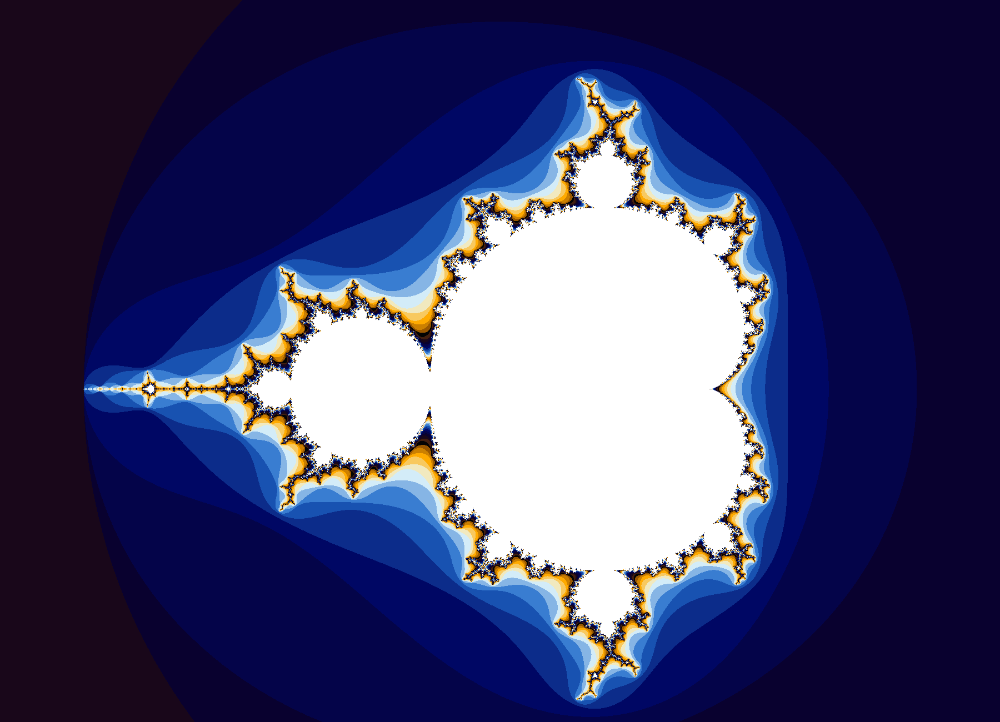

# Mandelbrot set
### Simple multi-threaded program to paint Mandelbrot set picture using C++


 


## Mandelbrot principle:
We have following iteration rule with z<sub>0</sub> = 0 \
z<sub>n+1;</sub> = z <sub>n</sub> &sup2; + c \
Complex number c belongs to Mandelbrot set if its absolute value does not diverge when applying this iteration repeatedly.
For programming I used condition that c belongs to Mandelbrot if |z <sub>n</sub>| < 2 for n = 0, 1, ... n<sub>max</sub>.

I chose n<sub>max</sub> = 50, which is quite a common choice, the boundaries of Mandelbrot depend on that. All complex numbers c that belong to Mandelbrot will be assigned white color.

```cpp
// function to decide if the number 'belongs' to Mandelbrot
std::tuple<bool, int> Mandelbrot(std::complex<double> c){ 
    std::complex<double> current(0.0, 0.0); 
    for(auto i = 1; i < MAX_ITER; i ++){
        if(abs(current) > 2)
            return std::make_tuple(false, i-1); 
            //return index for which it starts to diverge
        current = std::pow(current,2) + c;
    }
    return std::make_tuple(true, MAX_ITER); 
}
```
If we count n for which the function starts to diverge for every c, then we can color the Mandelbrot picture. For example we assign the same color for every c that diverges between n = (0,20). Thanks to this number Mandelbrot picture will have many different coloured boundaries.

## ppm(portable pixmap file) format:
Very simple image format, that belongs to Netpbm group. \
Its structure consists of: \
'P6' to specify binary ppm file type (P3 for ASCII ppm) \
width and height\
maximum color value (255 in this case) \
rows of data

Following function writes our data into ppm format using ios ofstream:
```cpp
//function to write data into ppm file
bool save(std::string path){
        std::ofstream output(path, std::ios::out 
        | std::ios::trunc | std::ios::binary);
        if(output.is_open()){
            output << "P6" << std::endl;
            output << width << ' ' << height << std::endl;
            output << "255" << std::endl;
            output.write((char*)data,             width*height*3);
            output.close();
            return true;
        }
        else{
            return false;
        }
    }
```


## Using multiple threads:
Generating the picture using only 1 thread was very long proccess so I used 8 threads , which felt more optimal.
I used \<thread> C++ library.

```cpp
const int THREAD_NUM = 8;
std::thread threads[THREAD_NUM]; //create 8 threads
    double len_c = fabs(start_c - stop_c);
    for(auto i = 0; i < THREAD_NUM; i ++){
        std::cout << i << std::endl;
        //assign part of picture to thread
        threads[i] = std::thread(&make_image, &imag, &array_col, start_r, stop_r, start_c, stop_c,
            i*(len_c/THREAD_NUM) + start_c, (i+1)*(len_c/THREAD_NUM) + start_c);
    }

    for(auto i = 0; i < THREAD_NUM; i ++){
        threads[i].join(); //wait until all threads are finished
    }
```

Every thread draws 1/8 of the picture, for example 6th thread:
 